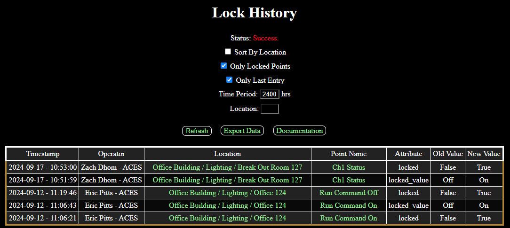

# LockHistory

WebCTRL is a trademark of Automated Logic Corporation. Any other trademarks mentioned herein are the property of their respective owners.

This WebCTRL add-on can be used to analyze locked point history parsed from the auditlog.

## Instructions

1. If signed add-ons are required, copy the authenticating certificate [*ACES.cer*](https://github.com/automatic-controls/addon-dev-script/blob/main/ACES.cer?raw=true) to the *./programdata/addons* directory of your *WebCTRL* installation folder.
2. Install [*LockHistory.addon*](https://github.com/automatic-controls/lock-history-addon/releases/latest/download/LockHistory.addon) using the *WebCTRL* interface.
3. Navigate to this add-on's main page (e.g, *localhost/LockHistory*).
4. Select the relevant options and click the *Refresh* button to load data from the auditlog. After refreshing, the *Export Data* button can be used to download a CSV document.

| Option | Decsription |
| - | - |
| *Sort By Location* | If this is checked, then results will be sorted by location and microblock, as opposed to using chronological order only. |
| *Only Locked Points* | If this is checked, then results will be filtered to include only those points which are currently locked. |
| *Only Last Entry* | If this is checked, then results will be filtered to include only the last entry for a given location. |
| *Time Period* | Specifies how many hours into the past that data should be collected from. |
| *Location* | An optional location filter. Type the reference name of some location on the Geo tree. |

It only checks the auditlog. It does not check equipment for locked points directly. The time period field determines how far to go back in the auditlog. So if a point was locked a year ago, and the field is only set to go back one month, the point will not show up.